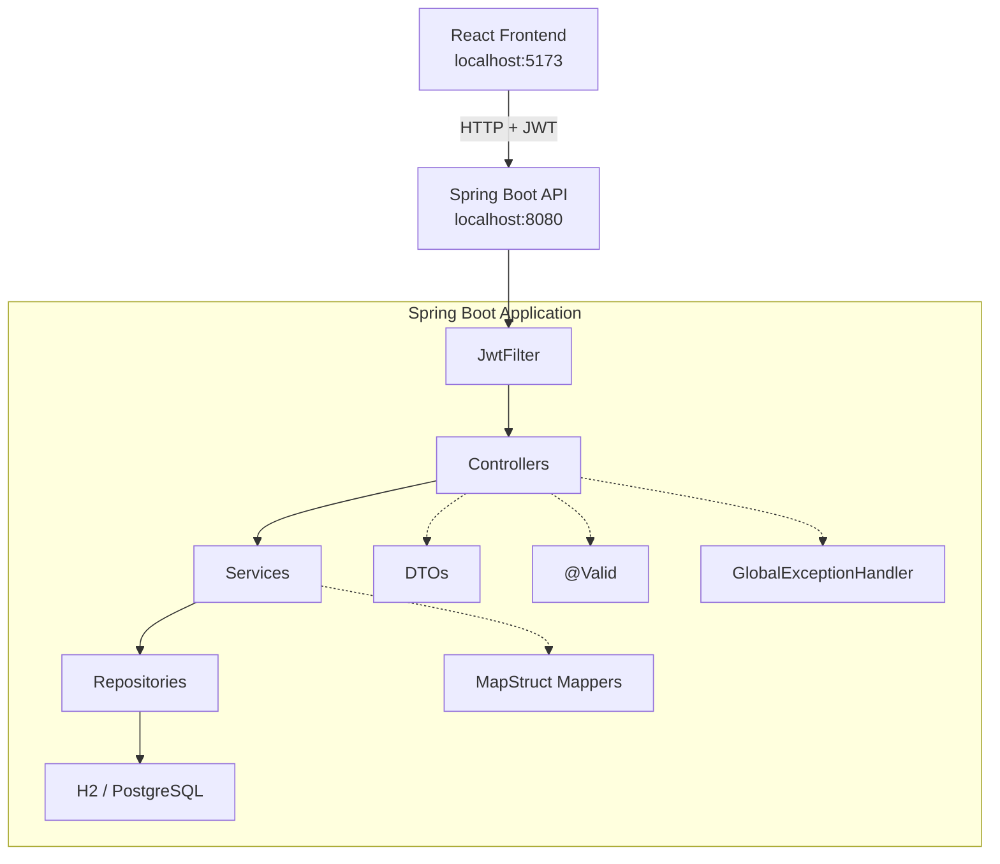
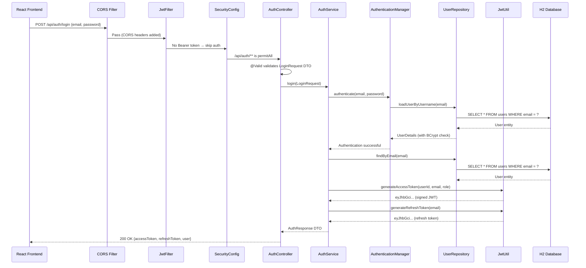
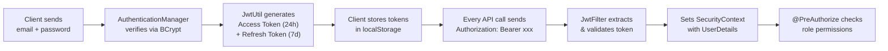
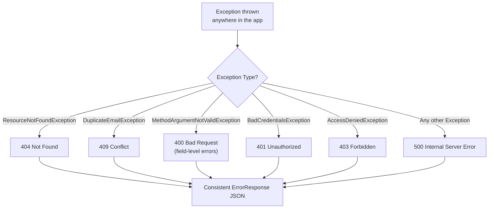
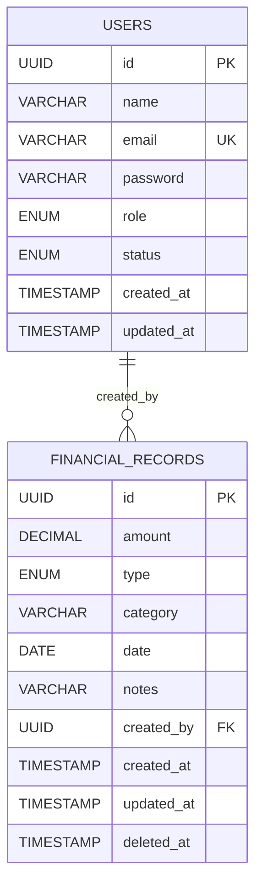

# FinanceBoard Backend — Architecture Deep Dive

A complete breakdown of how the FinanceBoard API is structured, how data flows through the system, and the design decisions behind every layer.

---

## System Overview



---

## Layered Architecture

The backend follows a strict **4-layer architecture** where each layer has a single responsibility and only communicates with adjacent layers:

```
┌─────────────────────────────────────────────────┐
│  CONTROLLER LAYER  (HTTP ↔ DTO translation)     │
│  AuthController, RecordController, etc.         │
├─────────────────────────────────────────────────┤
│  SERVICE LAYER  (Business logic)                │
│  AuthService, RecordService, DashboardService   │
├─────────────────────────────────────────────────┤
│  REPOSITORY LAYER  (Data access)                │
│  UserRepository, FinancialRecordRepository      │
├─────────────────────────────────────────────────┤
│  ENTITY LAYER  (Domain model)                   │
│  User, FinancialRecord + Enums                  │
└─────────────────────────────────────────────────┘
```

### Why This Matters
- **Controllers** never touch the database directly
- **Services** never know about HTTP status codes
- **Repositories** never contain business logic
- **Entities** are pure data models with no framework logic

---

## Full Request Lifecycle

Here's exactly what happens when the frontend calls `POST /api/auth/login`:



---

## Project Structure — File by File

```
d:\Z\backend\src\main\java\com\financeboard\
│
├── FinanceBoardApplication.java          ← Entry point
│
├── config/                               ← Framework configuration
│   ├── SecurityConfig.java               ← HTTP security, CORS, JWT filter chain
│   ├── SwaggerConfig.java                ← OpenAPI docs with JWT bearer auth
│   └── DataInitializer.java              ← Dev seed data (3 users + 20 records)
│
├── security/                             ← Auth infrastructure
│   ├── JwtUtil.java                      ← Token generation, validation, parsing
│   ├── JwtFilter.java                    ← OncePerRequestFilter — extracts JWT
│   └── UserDetailsServiceImpl.java       ← Bridges JPA User → Spring Security
│
├── controller/                           ← HTTP endpoints (thin layer)
│   ├── AuthController.java               ← POST /api/auth/login, register, refresh
│   ├── UserController.java               ← CRUD /api/users (Admin only)
│   ├── RecordController.java             ← CRUD /api/records (role-based)
│   └── DashboardController.java          ← GET /api/dashboard/* (analytics)
│
├── service/                              ← Business logic (thick layer)
│   ├── AuthService.java                  ← Register, login, refresh token
│   ├── UserService.java                  ← User CRUD + status toggle
│   ├── RecordService.java                ← Transaction CRUD + soft delete
│   └── DashboardService.java             ← Aggregation & trend computation
│
├── repository/                           ← Data access (Spring Data JPA)
│   ├── UserRepository.java               ← findByEmail, existsByEmail
│   └── FinancialRecordRepository.java    ← 7 JPQL queries for dashboard
│
├── entity/                               ← JPA domain models
│   ├── User.java                         ← UUID PK, role, status, timestamps
│   └── FinancialRecord.java              ← Soft-delete via @SQLRestriction
│
├── dto/                                  ← Request/Response objects (15 files)
│   ├── LoginRequest, RegisterRequest     ← Auth input
│   ├── AuthResponse, RefreshTokenRequest ← Auth output
│   ├── CreateRecordRequest, UpdateRecordRequest ← Record input
│   ├── RecordResponse, UserResponse      ← Output
│   ├── DashboardSummary, CategoryTotal, TrendData ← Analytics
│   ├── PageResponse                      ← Generic paginated response
│   └── ErrorResponse                     ← Standardized error format
│
├── enums/                                ← Type-safe constants
│   ├── Role.java                         ← ADMIN, ANALYST, VIEWER
│   ├── Status.java                       ← ACTIVE, INACTIVE
│   └── TransactionType.java              ← INCOME, EXPENSE
│
├── mapper/                               ← Entity ↔ DTO mapping (MapStruct)
│   ├── UserMapper.java                   ← User → UserResponse
│   └── RecordMapper.java                 ← FinancialRecord → RecordResponse
│
└── exception/                            ← Error handling
    ├── ResourceNotFoundException.java    ← 404
    ├── DuplicateEmailException.java      ← 409
    └── GlobalExceptionHandler.java       ← @RestControllerAdvice
```

---

## Security Architecture

### Authentication Flow (JWT)



### JWT Token Structure

```json
// Access Token Payload
{
  "sub": "admin@finance.com",
  "userId": "a1b2c3d4-...",
  "role": "ADMIN",
  "iat": 1712233200,
  "exp": 1712319600       // 24 hours
}
```

### Key Security Decisions

| Decision | Implementation | Why |
|----------|---------------|-----|
| **Stateless sessions** | `SessionCreationPolicy.STATELESS` | No server-side session storage; JWT is self-contained |
| **BCrypt passwords** | `BCryptPasswordEncoder` | Industry standard, automatic salting, configurable cost |
| **HMAC-SHA256 signing** | `Keys.hmacShaKeyFor(Base64)` | Symmetric key; fast token validation |
| **Role in JWT claims** | `"role": "ADMIN"` | Avoids DB lookup on every request for role checks |
| **CORS whitelist** | `localhost:5173, :3000` | Only the React frontend can call the API |

### Authorization Matrix (via `@PreAuthorize`)

```java
// DashboardController.java
@PreAuthorize("hasAnyRole('ADMIN','ANALYST','VIEWER')")  // Summary — everyone
@PreAuthorize("hasAnyRole('ADMIN','ANALYST')")            // Analytics — no viewers
@PreAuthorize("hasRole('ADMIN')")                          // User CRUD — admin only
```

| Endpoint | ADMIN | ANALYST | VIEWER |
|----------|:-----:|:-------:|:------:|
| `POST /api/auth/*` | ✅ | ✅ | ✅ |
| `GET /api/dashboard/summary` | ✅ | ✅ | ✅ |
| `GET /api/dashboard/category-totals` | ✅ | ✅ | ❌ |
| `GET /api/dashboard/monthly-trends` | ✅ | ✅ | ❌ |
| `GET /api/records` | ✅ | ✅ | ✅ |
| `POST /api/records` | ✅ | ❌ | ❌ |
| `DELETE /api/records/{id}` | ✅ | ❌ | ❌ |
| `GET /api/users` | ✅ | ❌ | ❌ |
| `POST /api/users` | ✅ | ❌ | ❌ |

---

## Data Handling Patterns

### 1. Soft Deletes

Records are **never physically deleted**. Instead, a `deleted_at` timestamp is set:

```java
// FinancialRecord.java
@SQLRestriction("deleted_at IS NULL")   // Hibernate 6.3+ auto-filter
public class FinancialRecord {
    @Column(name = "deleted_at")
    private LocalDateTime deletedAt;    // null = live, set = deleted
}

// RecordService.java
public void softDeleteRecord(UUID id) {
    FinancialRecord record = findRecordOrThrow(id);
    record.setDeletedAt(LocalDateTime.now());   // Mark, don't delete
    recordRepository.save(record);
}
```

> [!IMPORTANT]
> `@SQLRestriction("deleted_at IS NULL")` ensures that **all JPA queries automatically exclude** soft-deleted records. No manual `WHERE` clause needed.

### 2. DTO ↔ Entity Mapping (MapStruct)

Entities are **never exposed** directly in API responses. MapStruct generates type-safe mapping code at compile time:

```java
// RecordMapper.java
@Mapper(componentModel = "spring")
public interface RecordMapper {
    @Mapping(source = "createdBy.id", target = "createdById")
    @Mapping(source = "createdBy.name", target = "createdByName")
    RecordResponse toResponse(FinancialRecord record);
}
```

**Why MapStruct instead of manual mapping?**
- Zero reflection overhead (generates plain Java code)
- Compile-time error checking (typo in field name → build fails)
- Automatic null-safety handling
- Nested object traversal (`createdBy.name`)

### 3. Pagination

All list endpoints return a consistent `PageResponse<T>` wrapper:

```java
// PageResponse.java — Generic for any entity
@Builder
public class PageResponse<T> {
    private List<T> content;
    private int page;
    private int size;
    private long totalElements;
    private int totalPages;
    private boolean last;
}
```

**Usage in RecordService:**
```java
Page<FinancialRecord> pageResult = recordRepository.findAllFiltered(
    type, category, startDate, endDate,
    PageRequest.of(page, size, sort)
);
// Spring Data JPA handles LIMIT/OFFSET + COUNT automatically
```

### 4. Complex JPQL Queries (Dashboard Analytics)

The repository contains **7 custom JPQL queries** for analytics aggregation pushed to the database level:

```java
// Sum all income/expenses
@Query("SELECT COALESCE(SUM(r.amount), 0) FROM FinancialRecord r WHERE r.type = :type")
BigDecimal sumByType(@Param("type") TransactionType type);

// Category breakdown
@Query("SELECT r.category, r.type, SUM(r.amount) FROM FinancialRecord r " +
       "GROUP BY r.category, r.type ORDER BY SUM(r.amount) DESC")
List<Object[]> getCategoryTotals();

// Monthly trends (returns period + type + sum)
@Query("SELECT MONTH(r.date), r.type, SUM(r.amount) FROM FinancialRecord r " +
       "WHERE YEAR(r.date) = :year GROUP BY MONTH(r.date), r.type ORDER BY MONTH(r.date)")
List<Object[]> getMonthlyTrends(@Param("year") int year);
```

> [!TIP]
> Aggregation in JPQL (pushed to the DB engine) is **orders of magnitude faster** than loading all records into Java and computing in-memory.

### 5. Trend Data Aggregation (Service Layer)

Raw JPQL rows are pivoted into a usable structure in `DashboardService`:

```java
private List<TrendData> aggregateTrends(List<Object[]> rows) {
    Map<Integer, TrendData> map = new LinkedHashMap<>();  // preserves order
    
    for (Object[] row : rows) {
        int period = ((Number) row[0]).intValue();        // Month or week number
        TransactionType type = (TransactionType) row[1];
        BigDecimal sum = (BigDecimal) row[2];
        
        TrendData td = map.computeIfAbsent(period, p ->   // Create if missing
            TrendData.builder().period(p)
                .income(BigDecimal.ZERO)
                .expense(BigDecimal.ZERO).build());
        
        if (type == TransactionType.INCOME) td.setIncome(sum);
        else td.setExpense(sum);                           // Pivot row→column
    }
    return new ArrayList<>(map.values());
}
```

**What this does:** Transforms flat DB rows `[1, INCOME, 5000], [1, EXPENSE, 3000], [2, INCOME, 7000]` into pivoted objects `[{period:1, income:5000, expense:3000}, {period:2, income:7000, expense:0}]` — ready for chart rendering.

---

## Error Handling Strategy

A single `@RestControllerAdvice` class handles **all exceptions** and produces consistent JSON:



**Every error response** uses the same structure:
```json
{
  "status": 400,
  "error": "Bad Request",
  "message": "amount: Amount must be positive; category: Category is required",
  "timestamp": "2026-04-04T14:30:00"
}
```

### Validation Flow

```java
// CreateRecordRequest.java
@NotNull(message = "Amount is required")
@Positive(message = "Amount must be positive")
private BigDecimal amount;

@NotBlank(message = "Category is required")
private String category;

// RecordController.java
@PostMapping
public ResponseEntity<RecordResponse> create(@Valid @RequestBody CreateRecordRequest request) {
    // If validation fails → MethodArgumentNotValidException → GlobalExceptionHandler
    // → 400 with field-level messages
}
```

---

## Configuration & Profiles

```
application.properties          ← Shared (JWT secret, Swagger config, port)
application-dev.properties      ← H2 in-memory database, DDL auto-create
application-prod.properties     ← PostgreSQL, DDL validate-only
```

### Profile Activation

| Environment | Command | Database | DDL Strategy |
|------------|---------|----------|-------------|
| **Development** | `mvnw spring-boot:run` | H2 (in-memory) | `create-drop` |
| **Production** | `mvnw spring-boot:run -Pprod` | PostgreSQL | `validate` |

---

## Design Patterns Used

| Pattern | Where | Purpose |
|---------|-------|---------|
| **Builder** | Entities, DTOs (`@Builder`) | Clean object construction without telescoping constructors |
| **Repository** | `JpaRepository<T, UUID>` | Abstracts all SQL; provides `findById`, `save`, `delete` for free |
| **Strategy** | `@PreAuthorize` role checks | Different behavior per role without `if/else` chains |
| **Filter Chain** | `JwtFilter → SecurityFilterChain` | Intercepts requests before they reach controllers |
| **DTO / Anti-Corruption Layer** | MapStruct mappers | Prevents internal domain model from leaking to API consumers |
| **Soft Delete** | `@SQLRestriction` + `deletedAt` | Data recovery, audit trail, referential integrity preservation |
| **Template Method** | `GlobalExceptionHandler.buildResponse()` | Shared error response construction |
| **Factory** | `DaoAuthenticationProvider` | Spring creates the right auth provider from config |

---

## Database Schema (Generated by JPA)



### Key Constraints
- `users.email` — **UNIQUE** index (enforced at DB + app level)
- `financial_records.created_by` — **FOREIGN KEY** → `users.id`
- `financial_records.deleted_at IS NULL` — Auto-filter via `@SQLRestriction`
- All `amount` fields use `BigDecimal(15,2)` — no floating-point precision errors

---

## Summary: Why This Architecture Works

| Principle | Implementation |
|-----------|---------------|
| **Separation of Concerns** | Each layer (Controller → Service → Repository) has exactly one job |
| **Don't Repeat Yourself** | MapStruct, `PageResponse<T>`, `GlobalExceptionHandler` eliminate boilerplate |
| **Fail Fast** | `@Valid` rejects bad input at the controller gate before any business logic |
| **Secure by Default** | All endpoints require JWT; only `/api/auth/**` and `/swagger-ui/**` are public |
| **Data Integrity** | Soft deletes, `@Transactional`, UUID primary keys, BCrypt passwords |
| **Testability** | Constructor injection everywhere; no static methods; interfaces for all repos |
| **Production Ready** | Profile-based config; CORS; structured logging; Swagger docs |
